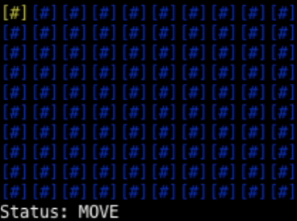

# Minesweeper
A Minesweeper clone written in Typescript.



## Auto-solver
[Docs/previews for the auto-solving script](/docs/auto-solver.md)
## How to use
Can be either played or used as a lib.
### Play
```sh
git clone https://github.com/sherex/minesweeper
cd minesweeper
npm install
npm run build
# Arguments: X Y Bombs
npm start -- 20 20 50
```
Use the arrowkeys to move around the grid, enter to open the cell and space to flag.

To start the auto solver use `node dist/bin/solve.js 20 20 50`.

You can also use `node dist/bin/cli-input.js 20 20 50` to use a prompt based interaction. (for ex. `f2,3` or `o4,3`)

### Lib
Check out [`src/bin/index.ts`](/src/bin/index.ts) for example usage.

## TODO
- [X] Add auto-open cells with no bombs
- [X] Add win-condition
- [ ] Smarter bomb placement generation
- [ ] Check actual game rules and implement them
  - [X] No bombs around first opened cell
- [ ] And more..

## Goals
- [X] First opened cell should be a good start area
- [ ] No 50/50 cells
- [X] Auto-solve

## LICENSE
[MIT](LICENSE)