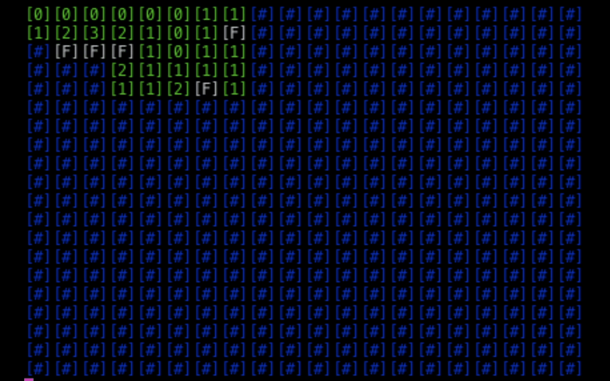
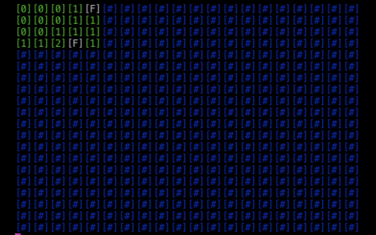

[<== Back](https://github.com/sherex/minesweeper)

# Minesweeper auto-solver
The main reason to create this project was to easily test the auto-solver while I created it.
And then use the auto-solver to develop a 50/50 free minesweeper.

**Script:** [/src/bin/solve.ts](/src/bin/solve.ts)

## Flow
1. Open one cell (currently 1,1)
2. Loop through the opened cells
3. On the current cell:
    - Get amount of closed neighbouring cells
    - Subract the flagged cells from the amount of bombs nearby (ex. 2 bombs nearby - 1 flagged cell = 1 unknown bomb nearby)
4. If number of closed cells === number of bombs nearby; flag the closed cells.
5. If number of closed cells > 0 && number of unknown bombs nearby === 0; open the closed cells.
6. Rinse and repeat (from step 2)

If number of opened cells is the same two rounds in a row, it exits and reports a 50/50. (This will help me develop a way to stop 50/50's from occuring)

### TODO
- [ ] Smarter way to loop over remaining cells. (Currently it loops over all opened cells, maybe store all opened cells with >0 unknown bombs nearby)

## Previews
> No clue why there is a resolution difference, same recording different sections..

> There is a 500ms delay between each iteration, to illustrate how it works (ish).

Winning :)

Encountering the dreaded 50/50 :/

